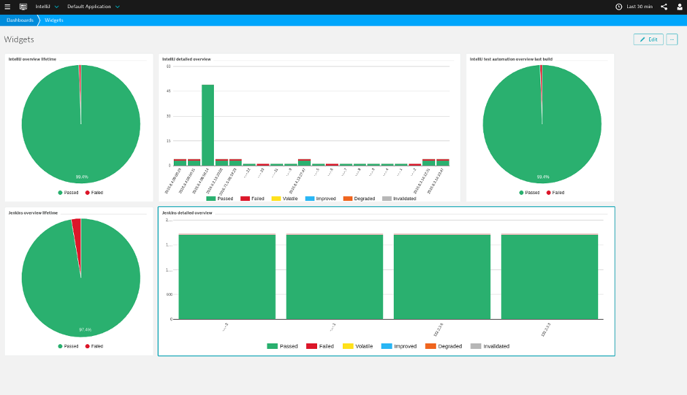
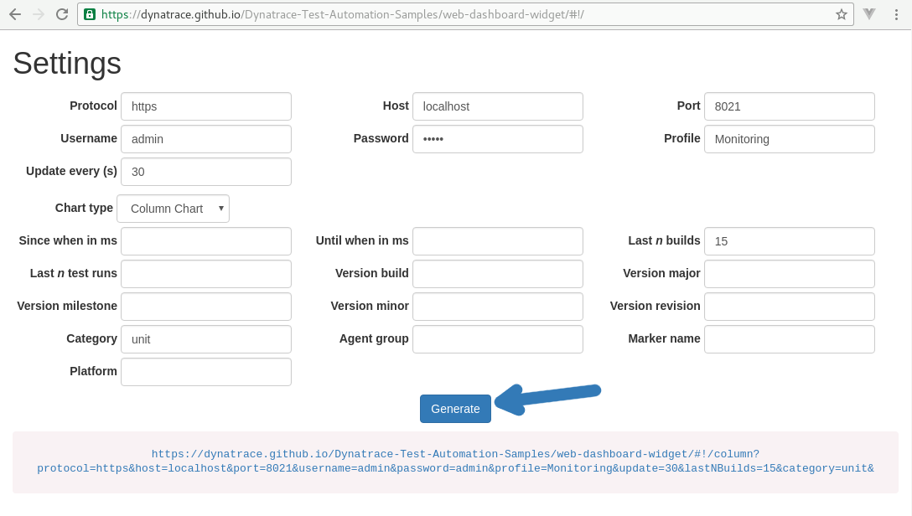
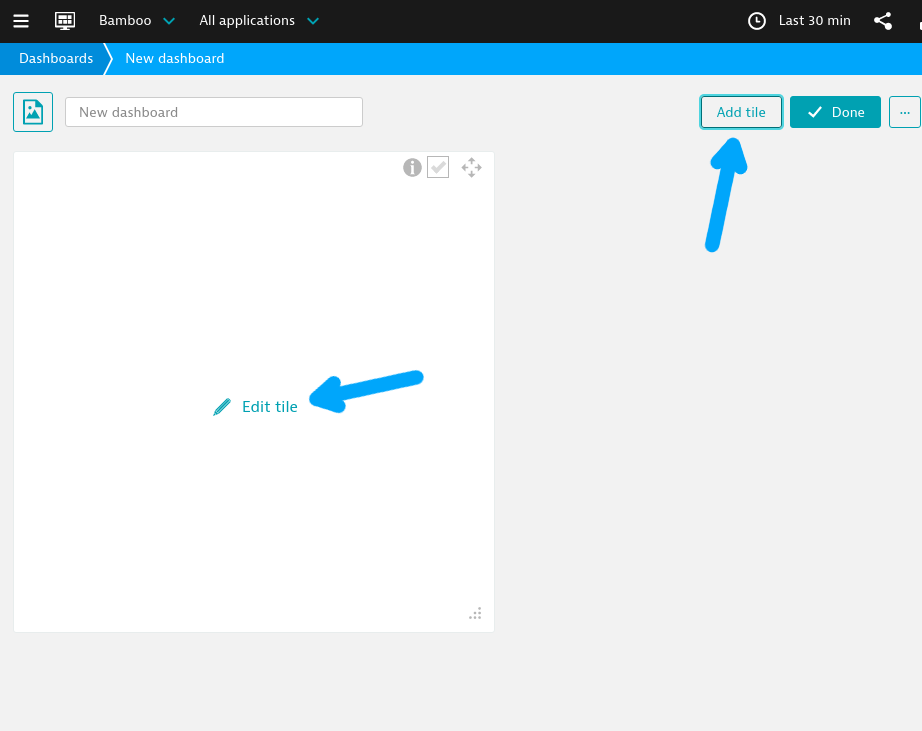
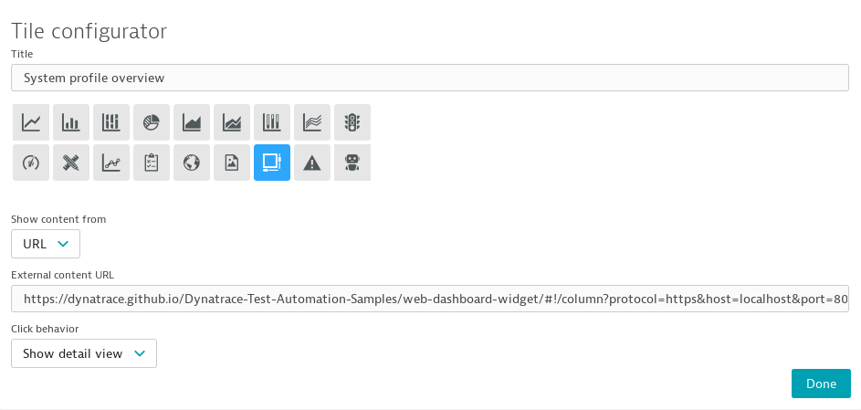

# Web Dashboard Widget

Web Dashboard widget allows you to display Test Automation data on your Dynatrace WEB Dashboard.



## Usage

### Generating Chart

1. Go to [dynatrace.github.io/Dynatrace-Test-Automation-Samples/web-dashboard-widget](https://dynatrace.github.io/Dynatrace-Test-Automation-Samples/web-dashboard-widget) or your self-hosted version of this project
2. Change settings at the top to match your configuration
3. Fill in filters you want to apply
4. Click generate and copy the generated link



### Adding tile to WEB Dashboard

1. Go to your web dashboard, by default it's available under *https://<host>:9911/*
2. Click *Add Tile* and click on the new tile.
   
3. Click on the *External Content* tile type and paste in the link you generated in the previous step
   
4. After confirming your configuration your new shiny tile should be available in the dashboard, you can resize it.
   

### Embedding chart on your website

<p style="font-size: 200%; color: darkred; line-height: 1.2;">Do not embed the chart on any publicly available website unless you are running a proxy hiding your credentials to the server!</p>


To embed a chart on your **LOCAL/INTRANET** website put the following code somewhere in the source.
```html
<iframe sandbox="allow-popups allow-scripts" scrolling="no" src="your generated link"></iframe>
```

## Building

1. Install required dependencies by executing
   > npm install
1. Build the javascript by running
   > npm run build
1. Copy */js* and *index.html* to your site's directory

## Developing
If you are making changes to this project and want a hot-reload feature, use:
> npm run dev

**Feel free to send Pull Requests**

## Help & Troubleshooting

### Chart is not visible, and instead *Error: 404 NotFound* is shown:
   
   #### Cause: System profile has not been found on the server
   
   #### Solution:
   
   1. Check if the System Profile you have supplied is available
   1. Click the *Go to settings wizard* and generate a new link

### Chart is not visible, and instead *No test metadata was set or no testrun occurred between ...* is shown:
   
   #### Cause: There was no test automation data registered

   #### Solution:
   
   1. Register and run some tests

### The site is completely blank

   #### Solution:

   1. Check if connection details are correct
   2. Check if server's certificate is valid, and if not add it to bro
   1. wser exceptions
   3. Open developer console (*F12* under chrome), go to console and see if any of the following errors is present:
       * Message containing: *CORS / Cross-Origin* keywords - use https for your server connection  